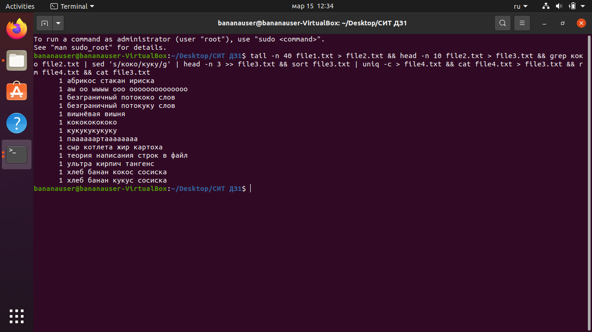

# Работа с текстом в BASH
## Могучая команда
<pre>
<code>
tail -n 40 file1.txt > file2.txt && head -n 10 file2.txt > file3.txt && grep коко file2.txt | sed 's/коко/куку/g' | head -n 3 >> file3.txt && sort file3.txt | uniq -c > file4.txt && cat file4.txt > file3.txt && rm file4.txt && cat file3.txt
</code>
</pre>
## Скриншот с результатами выполнения

