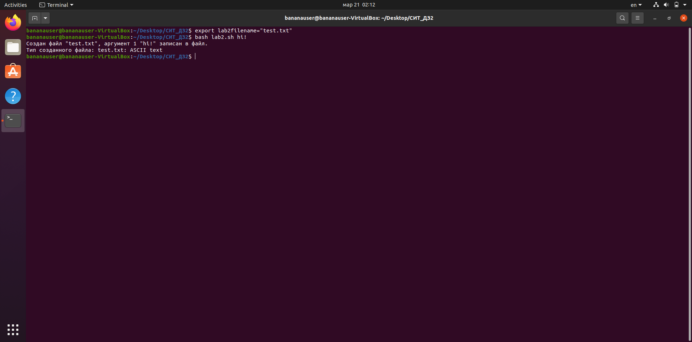

# BASH скрипт
## Какие действия выполняет скрипт

Скрипт берёт название файла из переменной среды <code>lab2filename</code> и ищет файл с таким же названием в своей директории.

Если такой файл найден, скрипт уведомляет о перезаписи содержимого файла на первый аргумент скрипта и выводит его тип.

Если такой файл не найден, скрипт уведомляет о создании нового файла и записи в него первого аргумента. Далее скрипт выводит тип созданного файла.

Если не задана перменная среды или первый аргумент, скрипт завершит работу с ошибкой.

## Что сделать, чтобы работало

Сначала нужно создать переменную среды lab2filename: <code>export lab2filename="имя файла"</code>.

Далее запустить скрипт: <code>bash lab2.sh аргумент</code>.

## Результат

