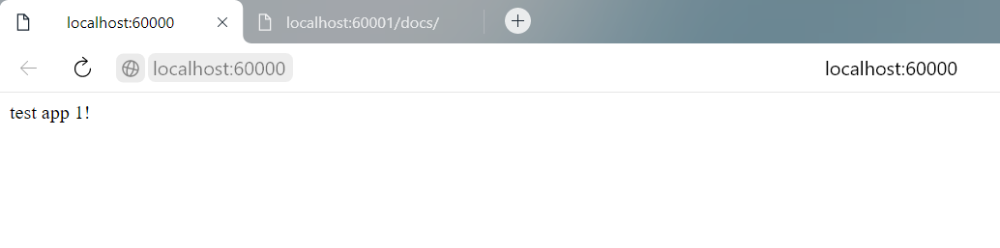
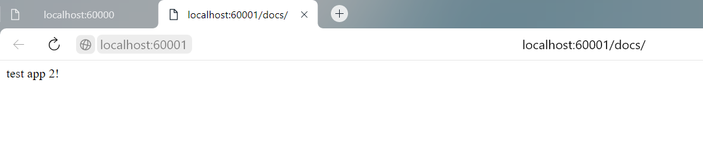
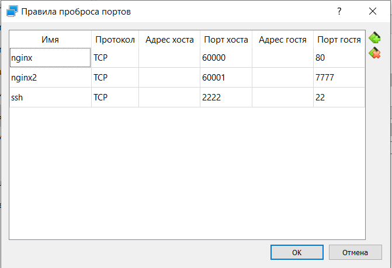

# NGINX

Скриншоты работы приложений

Для приложений понадобилось делать проброс портов. Скриншот конфигурации VirtualBox:

Файлы "index1.html" и "index2.html" изначально назывались "index.html".

